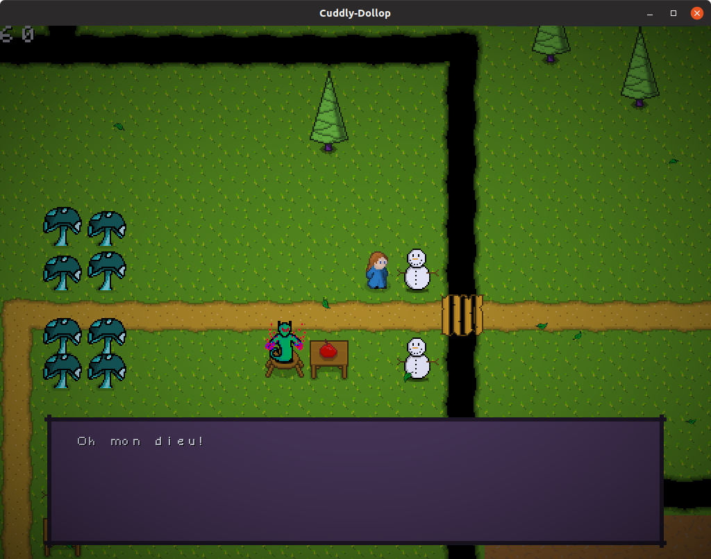
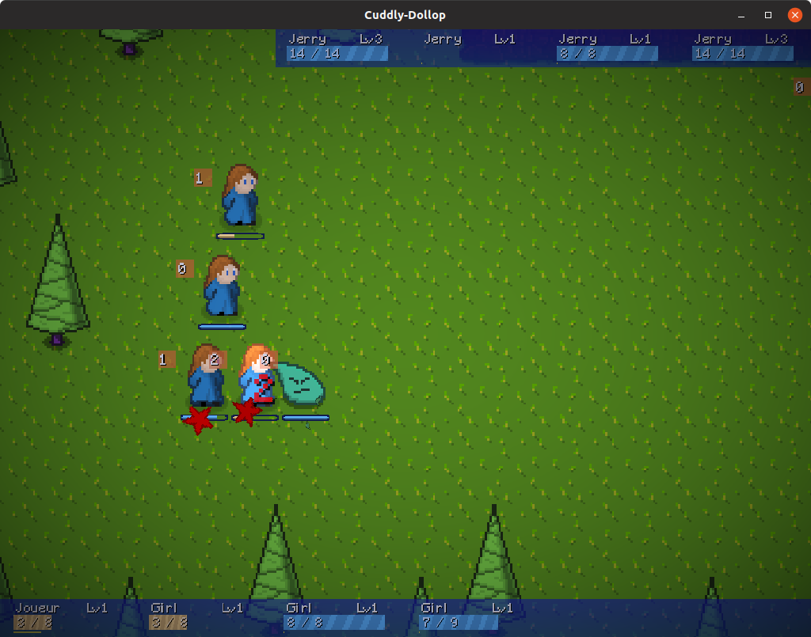
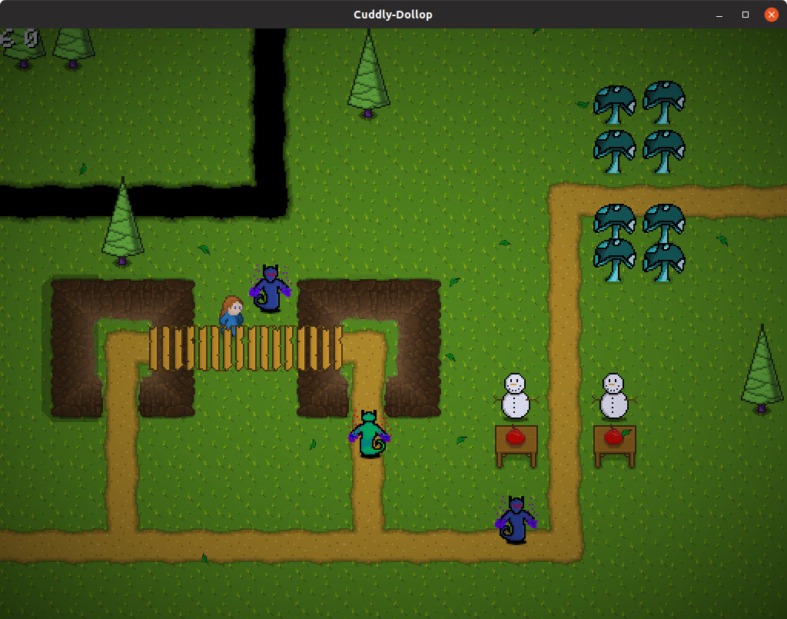
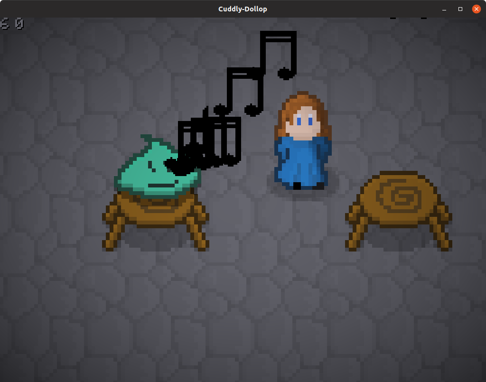

# cuddly-dollop - C++ game engine from scratch

An ongoing project for a few years, many aspects of the engine need remodeling.

## Requirements:
- CMake
- C++17
- OpenAL (can download online)

Notable aspects:
- Use of "scenes" to easily swap between different logical states of gameplay.
- OpenGL wrapper to handle buffers cleanly
- C# level editor to create content in the form of JSON files
- Events can contain events that contain events - allows for complex decision trees that can be based on user input

Libraries used:
- OpenGL
- OpenAL
- DevIL
- GLEW
- rapidJSON
- GLFW

## Screenshots

